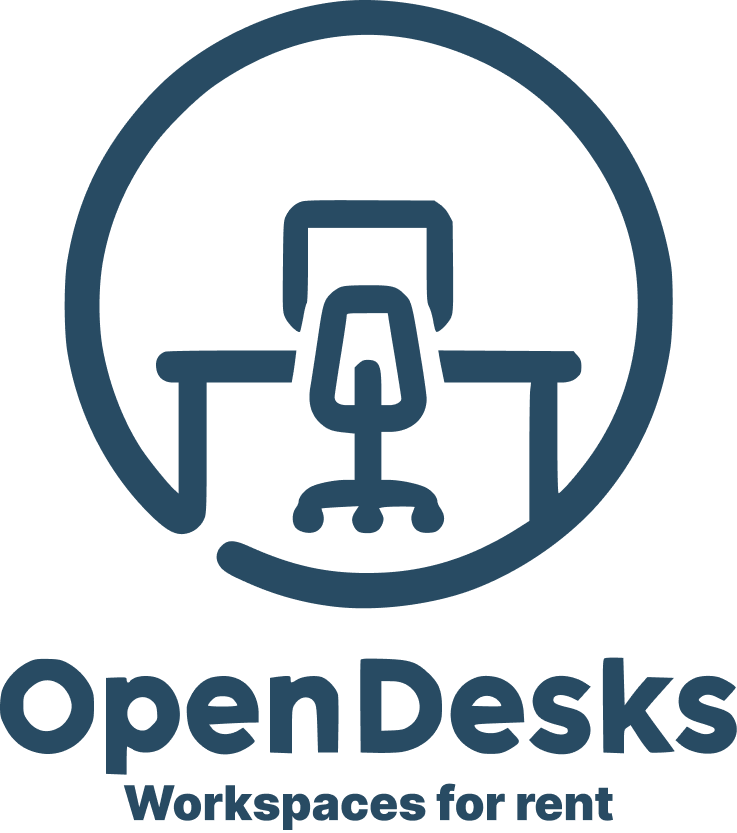

<h1 align="center">
  <br>
  <a href=""></a>
  <br>
  Open Desks Api
  <br>
</h1>

<h4 align="center">A simple API for a workspace rental App</h4>

## How To Use

To clone and run this application, you'll need [Git](https://git-scm.com) and [Node.js](https://nodejs.org/en/download/) (which comes with [npm](http://npmjs.com)) installed on your computer. From your command line:

```bash
# Clone this repository
$ git clone https://github.com/BrunoAccorsi/open-desks-api.git

# Go into the repository
$ cd open-desks-api

# Install dependencies
$ npm install

# Run the app
$ npm run start
```
